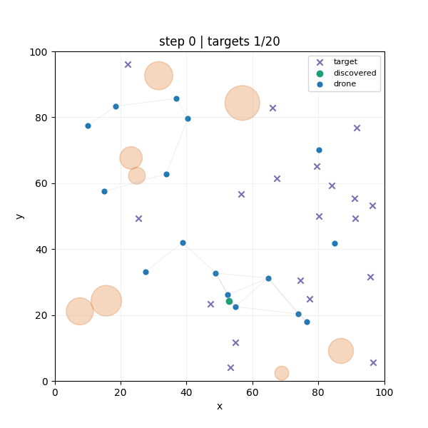
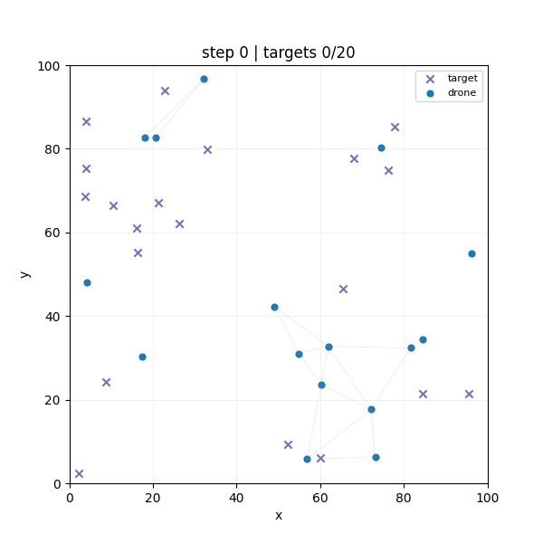
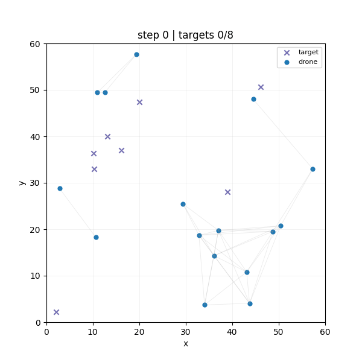
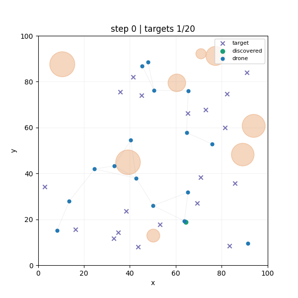

# Results

This page now DroneWatch as an ablation study.

Example rendering of the final agent:

{ width="50%" }

Each rendered GIF is a time series of simulator snapshots.
Each frame is drawn from the simulator state after a reset or step. Blue filled circles are drones. Their positions are the current agent locations in the 2D world. 
Orange translucent circles are obstacles or no-fly zones.
Purple x markers are targets that have not been discovered yet. Green filled circles are targets that have already been discovered. This shows progress over time.
Thin gray lines between drones are communication links. A line is drawn only when two drones are within the configured communication radius, so the line network visualizes who can currently talk to whom.


### Summary of training results

The current agent training supports the following conclusions.

1. LSTM was necessary. Feedforward PPO was sufficient for smoke-testing the stack, but not for robust search behavior.
2. Curriculum and easier scenarios were useful as proof-of-learnability, not as an end state. The easy environment showed that the policy class could solve the task at all.
3. Reward rebalancing and PPO stabilization mattered as much as architecture choice. Lower entropy, tighter action noise, smaller PPO updates, and reward rescaling changed the training dynamics materially.
4. Mixed rewards worked best: global terms promoted mission success and coverage, while local terms gave each drone clearer credit for discoveries, collisions, and obstacle violations.

Obstacle-heavy search is solved in the task-completion sense and generalizes well to new scenarios, but still not solved in the safety sense. The agent finishes the mission while accepting a non-zero rate of obstacle violations and collisions. This could be further enforced by longer training, early termination on obstacle entry or masking of illegal actions.


## Ablation Axes

The experiments in this repository vary four main dimensions.

| Axis | Variants | Why it mattered |
| --- | --- | --- |
| Scenario | `swarm_search_easy`, `swarm_search_v1`, `swarm_search_v2` | Controls world size, target count, and obstacle pressure. |
| Architecture | `ppo_feedforward`, `ppo_lstm` | Tests whether memory is needed to avoid repeatedly searching the same regions and to finish the last targets. |
| Reward regime | default, rescaled, mixed/custom, stronger obstacle penalties | Tests whether the discovery objective dominates coverage, collisions, and exploration side effects. |
| PPO stability settings | entropy coefficient, `log_std_clip_param`, `clip_param`, gradient clipping, learning rate, sequence length | Tests whether promising policies remain stable instead of collapsing late in training. |

## Architecture Ablation

The most important architecture lesson is that feedforward control was not enough for the full search problem.

| Architecture | Expected benefit | What happened | Interpretation |
| --- | --- | --- | --- |
| Feedforward | Simpler baseline, cheaper training, enough capacity for local obstacle avoidance | The smoke baseline stayed far from solving the task and produced a pathological high-collision policy | Memory matters. A purely feedforward policy can pick up local heuristics while still failing to coordinate long-horizon search. |
| LSTM | Retain short-term search history, reduce repeated coverage, improve the chance of finding the last targets | LSTM unlocks strong performance on the easy scenario and can nearly solve the larger scenario, but still needs reward and PPO stabilization work | The recurrent policy was necessary but not sufficient. It solved the memory bottleneck, then exposed the reward-design and stability bottlenecks. |

The early feedforward policy learned a shallow local optimum, often drifting to a boundary and staying there, while the LSTM variants improved target discovery but still needed reward and hyperparameter changes to avoid collapse.

## Reward and Stability Ablation

The major training turn was not just switching to LSTM, but rebalancing the objective so task completion dominated coverage farming and unstable exploration.

### Reward Rebalance That Changed the Search Behavior

One of the decisive reward updates moved from:

```yaml
reward:
	target_discovered: 15.0
	new_coverage_cell: 0.05
	agent_collision: -0.05
	obstacle_collision: -0.2
	step_penalty: 0.0
	success_bonus: 100.0
	remaining_target_penalty: -0.005
	visible_target_approach: 0.1
```

to:

```yaml
reward:
	target_discovered: 15.0
	new_coverage_cell: 0.02
	agent_collision: -0.25
	step_penalty: -0.001
	success_bonus: 100.0
	remaining_target_penalty: -0.02
	visible_target_approach: 0.1
```

Coverage had become too easy to exploit, collisions were too cheap, and failing to find the last targets was not punished strongly enough. Lowering coverage reward, increasing collision cost, and increasing the penalty for unfinished targets moved the policy away from shallow coverage-heavy behavior.

### PPO Stability Changes That Matter Most

| Change | Why it was introduced | Observed effect |
| --- | --- | --- |
| Lower `entropy_coeff` | High entropy was rewarding memorization-resistant random behavior on fixed maps and later caused policy collapse on randomized maps | Helped the policy commit to successful search behavior instead of drifting back into exploration-heavy modes |
| Lower `log_std_clip_param` | The action space is bounded in `[-1, 1]`, so a very loose action standard deviation cap was too permissive | Reduced action noise and made trained policies more deterministic |
| Lower `clip_param` and learning rate | Promising policies were collapsing late in training | Made policy updates less destructive and improved stability on randomized scenarios |
| Reward rescaling | Very large aggregate shared rewards made value prediction harder | Helped training stabilize and improved the link between reward and task completion |
| Longer `max_seq_len` | Short recurrent windows were likely truncating useful history | The committed LSTM config now uses `max_seq_len: 100`|


## Chronology of Major Experiment Updates

Documentation of the ablation experiments, and how they are interpreted.

Random Policy for comparison:

{ width="50%" }

### 1. Feedforward baseline: valid training, wrong behavior

- Change: 5k-step feedforward PPO run with default settings and fixed seed.
- Motivation: start with the simplest architecture and confirm that the training stack works.
- Observation: collisions and connectivity metrics changed during training, but target discovery did not improve enough; rendered rollouts showed drones drifting toward a boundary and staying there.
- Interpretation: the agent found a shallow local optimum. Coverage and survival-like behavior were easier to learn than systematic search.
- Next idea: strengthen completion incentives, add visible-target shaping, and try an LSTM.

{ width="50%" }

### 2. First LSTM pass: better discovery, still unstable

- Change: switch to LSTM and add stronger task-shaping terms such as `success_bonus`, `remaining_target_penalty`, and `visible_target_approach`.
- Motivation: improve memory and make the final targets matter more.
- Observation: discovered target count improved, but later regressed; obstacle-violation behavior improved more cleanly than full task completion.
- Interpretation: memory helped, but the reward balance and PPO update dynamics were still not stable enough.
- Next idea: simplify the task with a smaller environment, add agent identity to break symmetry, and revisit rollout and clipping choices.

### 3. Smaller environment curriculum: prove that the policy can solve the task

- Change: move to the easy scenario with fewer targets and a smaller world, then continue with LSTM and richer observations.
- Motivation: the agent needed more complete episodes where it actually collected the full success signal.
- Observation: success rose into the `0.6` to `0.7` range before plateauing. Longer training looked promising.
- Interpretation: the curriculum was valuable, but fixed-map learning still let entropy stay too high and did not guarantee a stable deterministic policy.

### 4. Lower entropy and reward scaling: the first clear stabilization win

- Change: lower entropy pressure, tighten action standard deviation clipping, and rescale rewards.
- Motivation: fixed maps allowed the agent to get rewarded while remaining too random, and the value function had trouble with oversized aggregate rewards.
- Observation: training on the fixed easy environment became more stable and converged quickly.
- Interpretation: the policy collapse problem was not just an exploration problem or just a reward problem. It was the interaction between noisy exploration, oversized returns, and weak completion pressure.
- Next idea: turn randomization back on and test whether the same recipe survives outside memorization-friendly maps.

### 5. Randomized maps: better generalization signal, new collapse mode

- Change: run the same LSTM recipe on randomized maps.
- Motivation: make sure success is not just memorization of one map layout.
- Observation: training looked promising early, then collapsed after roughly 200 episodes and started missing the final targets again.
- Interpretation: the recipe had enough capacity to learn the problem, but PPO still could not preserve the good policy once updates became too aggressive.
- Next idea: reduce learning rate and clipping range further and continue refining reward balance.

### 6. Rescaled reward plus collapse countermeasures: larger improvement on open maps

- Change: combine reward rescaling with smaller learning rate and narrower clip range.
- Motivation: stabilize the promising randomized-map regime instead of letting it overshoot.
- Observation: This worked better and produced the first robust large-world learning behavior.
- Repository evidence: `DroneWatchLSTMGeneralization/iteration_0700.json` shows the remaining gap clearly. The agent now finds almost all targets (`18.2/20` on average) but still finishes only `10%` of evaluation episodes and pays very high collision cost.
- Interpretation: the search signal improved before the coordination signal did.

{ width="50%" }

### 7. Larger world without obstacles: task nearly solved, coordination still weak

- Change: move from the small curriculum world to the larger no-obstacle environment.
- Motivation: test whether the improved recipe transfers once coverage and final-target search become harder again.
- Observation: target discovery stayed high, but collisions and episode length remained poor and final completion was inconsistent.
- Interpretation: this is where credit assignment and anti-crowding limitations became impossible to ignore.
- Next idea: add custom or mixed rewards and report shared and local reward separately.

### 8. Mixed reward reporting: success with lower collision cost

- Change: introduce mixed or custom reward accounting and additional logging for shared versus local reward.
- Motivation: distinguish between team-level completion incentives and per-agent shaping so that failure modes become diagnosable.
- Observation: the mixed-reward solves the large no-obstacle task cleanly. At `iteration_0150`, the policy reaches `success_rate = 1.0`, `mean_episode_length = 36.8`, and `mean_collision_count = 6.7`.
- Interpretation: once discovery and completion stay dominant and PPO updates remain stable, the LSTM policy can solve the larger scenario without obstacle pressure.

{ width="50%" }

### 9. Obstacle-heavy regime: task solved before safety is solved

- Change: reintroduce obstacles and strengthen obstacle penalties.
- Motivation: test whether the now-stable search policy can also learn no-fly-zone avoidance.
- Observation: the obstacle family reaches `success_rate = 1.0` very early, but obstacle violations remain stubborn. At `iteration_0500`, the policy still averages `3.9` obstacle violations and `9.0` collisions.
- Interpretation: reward can look strong in obstacle-heavy runs because the positive discovery and success terms dominate the penalty terms. This is exactly why the reward breakdown has to be read after the task metrics.
- Next idea: lower entropy further, keep standard deviation tight, and raise obstacle penalties again.

### 10. Longer obstacle training with stronger penalties: better, not perfect

- Change: train longer with stronger obstacle punishment.
- Motivation: reduce the remaining no-fly-zone violations that survived the first obstacle-success recipe.
- Observation: `iteration_1400` still solves every evaluation episode, reduces mean obstacle violations to `3.1`, and cuts mean episode length to `29.0`, but collisions remain non-trivial at `10.3`.
- Interpretation: the repository now demonstrates obstacle-capable task completion, but not hard constraint satisfaction.

{ width="50%" }

## Where Reports and Runs Live

- JSON reports: `artifacts/reports/`
- GIFs: `artifacts/gifs/`
- Checkpoints: `artifacts/checkpoints/ppo/`
- MLflow runs: `outputs/mlruns/`
