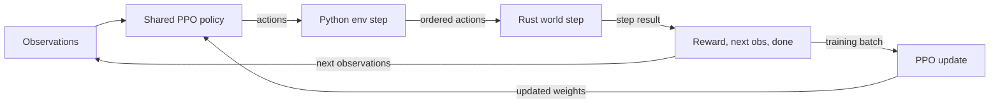
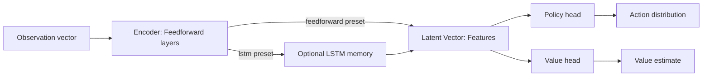

# Training Pipeline

This page explains the Python-side control flow for PPO training and checkpoint evaluation.

## Pipeline Overview

```text
CLI
  -> config loader
  -> typed config object
  -> RLlib PPOConfig builder
  -> RLlib env registration
  -> SwarmSearchEnv reset/step loop
  -> reward attribution and task metrics
  -> checkpoints, JSON reports, MLflow logs
```

### Drone Watch Training step:


Each training step follows the same loop: RLlib produces an action for each agent, the Python environment orders those actions for the simulator, the Rust world advances one timestep, and Python turns the returned `events`, `metrics`, and `state` into rewards, next observations, done flags, and logging signals.


## Training Entry Point

The main training entrypoint is `src/dronewatch/training/train_ppo.py`.

`main()` parses `--config` plus CLI overrides, then calls `load_config()`. The resulting `DroneWatchConfig` is passed to `train_ppo()`.

Inside `train_ppo()` the important steps are:

1. Create the run artifact directory
2. Save `resolved_config.yaml`
3. Start the MLflow run if logging is enabled
4. Build the PPO algorithm from `build_ppo_config()`
5. Train for `training.stop.iterations`
6. Save checkpoints at `training.checkpoint.frequency_iters`
7. Optionally run periodic evaluation and write JSON reports
8. Save the final checkpoint and return a compact run summary

## RLlib Configuration

`src/dronewatch/training/rllib_config.py` owns the RLlib-specific setup.

Key responsibilities:

- `register_swarm_search_env()` registers the RLlib environment name
- `shared_policy_mapping_fn()` maps every agent to the same PPO policy
- `build_ppo_config()` turns the typed config models into an RLlib `PPOConfig`

The environment registration step matters because checkpoint loading and fresh algorithm creation both depend on the registered environment name.

### Shared-policy training

DroneWatch uses parameter sharing for the homogeneous swarm. In practice, RLlib is configured with a single policy ID, `shared_policy`, and `shared_policy_mapping_fn()` returns that same policy for every agent.

The agents are homogeneous and receive the same observation structure and action space. The policy can still produce different behavior per drone because each agent sees a different local observation, even though the weights are shared.

### Network structure

The model definition comes from `ModelConfig` in `src/dronewatch/config/schema.py` and is translated into RLlib's `DefaultModelConfig` by `_model_config()`.

The current presets are simple on purpose:

- feedforward PPO uses a multilayer perceptron with `fcnet_hiddens`, `activation`, and `log_std_clip_param`
- LSTM PPO uses the same feedforward front-end, then adds `use_lstm`, `lstm_cell_size`, and `max_seq_len`

Conceptually, the network looks like this:



The feedforward preset uses the direct encoder path, while the LSTM preset inserts recurrent memory between the shared encoder and the PPO heads.

## Environment Wrapper

`src/dronewatch/envs/swarm_search_env.py` is the Python wrapper around the Rust simulator.

For the Rust-side simulator API and module structure, see the Rust Environment page.

Important behavior:

- `reset()` resets the simulator, rebuilds fixed-size observations, and returns initial metrics in `infos`
- `step()` converts RLlib's action dictionary into ordered simulator actions
- reward terms are split between shared team reward and locally attributed agent reward
- final `infos` include simulator metrics plus episode reward breakdown

This is the main Python orchetration layer between RLlib and the Rust simulation state.

## Observation Logic

Each drone receives a fixed-size, local observation built in `src/dronewatch/envs/observation_builder.py`: 

- The observation always includes the drone's own normalized ID, position, velocity, and episode progress, then appends padded slots for the nearest visible agents, targets, and obstacles.
- Nearby agents are represented by relative position, relative velocity, and distance, but only if they fall within the sensing radius.
- Nearby targets contribute relative position, distance, and whether each target has already been discovered.
- Nearby obstacles contribute relative position, obstacle radius, and distance for any obstacle whose boundary is close enough to be sensed.
- Communication is modeled as local proximity rather than explicit message passing. When `include_communication_summary` is enabled, each drone gets an extra summary over neighbors inside the communication radius: normalized neighbor count plus the mean relative position and mean relative velocity of those neighbors as well as sensed targets or obstacles.

Because RLlib expects a constant observation shape, each of these lists is sorted by distance and zero-padded up to the configured maximum counts.

## Reward Logic

`src/dronewatch/envs/reward.py` defines the reward surface.

Rust returns raw step events and cumulative metrics, and Python converts those into reward terms.

The current reward terms are:

- `target_discovery`
- `coverage`
- `agent_collision`
- `obstacle_collision`
- `step_penalty`
- `remaining_targets`
- `success_bonus`
- `visible_target_approach`

### Shared versus local reward

The reward is split into two pieces.

Shared terms are computed once for the whole team:

- `coverage`
- `step_penalty`
- `remaining_targets`
- `success_bonus`

These terms reflect global task progress. In `SwarmSearchEnv.step()`, the sum of these shared terms is divided evenly across all agents.

Local terms are attributed to specific agents:

- `target_discovery`
- `agent_collision`
- `obstacle_collision`
- `visible_target_approach`

These terms reflect which agents actually caused a useful event or constraint violation.

### How local attribution works

- target discovery reward is split across all agents that are within discovery radius of a newly discovered target
- agent collision penalty is split across the two colliding agents
- obstacle collision penalty is assigned to each agent overlapping an obstacle
- visible target approach reward is based on normalized progress toward the nearest visible undiscovered target

This keeps the cooperative team objective while still giving RLlib a more informative credit signal than a purely global reward would provide.

### Final per-agent reward

Inside `SwarmSearchEnv.step()`, the final reward given to each RLlib agent is:

```text
per_agent_reward = shared_reward / num_agents + local_reward_for_that_agent
```

So every drone shares the global task signal, but only the agent that contributed to a local event receives the corresponding local credit or penalty.

The environment also stores episode-level reward breakdowns in `infos`, in order expose both total reward and per-term reward metrics to the evaluation reports.

## Training Metrics

`src/dronewatch/training/callbacks.py` pushes task metrics into RLlib at episode end. These include:

- target discovery rate
- discovered target count
- coverage ratio
- collision count
- obstacle violation count
- connectivity ratio
- average communication neighbors
- success rate

These metrics are more informative than reward alone when you are deciding whether a policy is actually improving.

## Evaluation Path

`src/dronewatch/evaluation/evaluate.py` provides two main layers:

- `evaluate_checkpoint()` loads an algorithm from a saved checkpoint
- `evaluate_algorithm()` runs fresh episodes, optionally renders GIFs, and returns a structured report

The report format itself is defined in `src/dronewatch/evaluation/reporting.py` through:

- `episode_summary()`
- `aggregate_report()`
- `write_json_report()`

That report schema is shared across PPO evaluation and the random baseline so the outputs stay comparable.

## MLflow Integration

`src/dronewatch/logging/mlflow_logger.py` is intentionally small and explicit.

It handles:

- starting runs and nested child runs
- flattening config parameters
- logging numeric metrics
- logging evaluation summary metrics
- logging resolved configs and reports as artifacts

The local store is `outputs/mlruns/` unless overridden.
